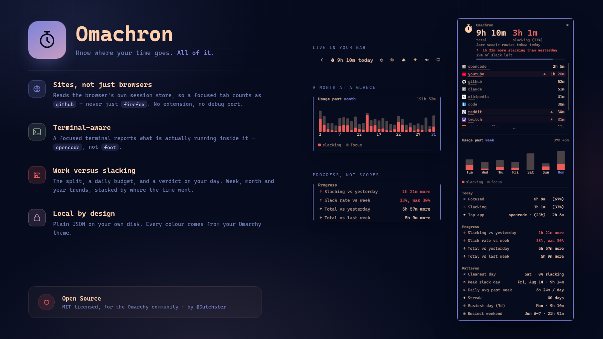
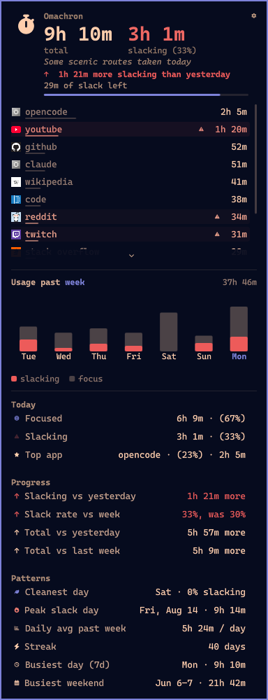
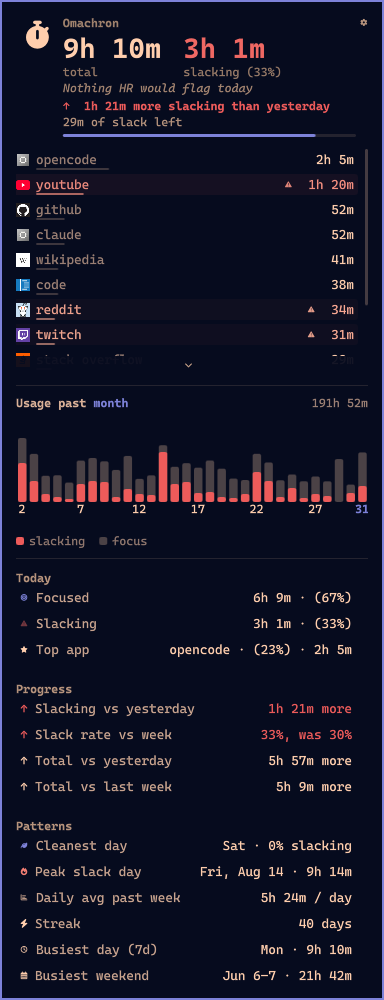
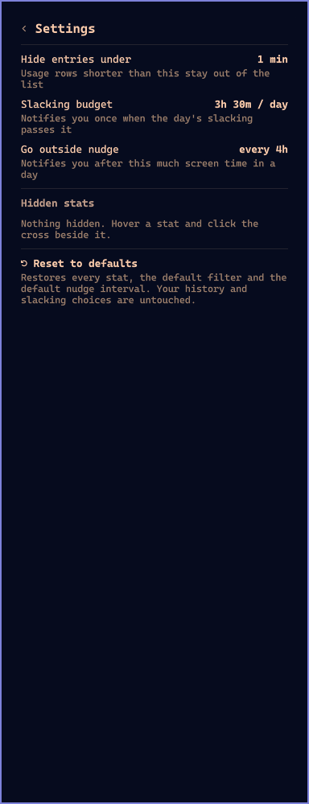

<p align="center">
  
</p>

# Omachron

Per-app and per-site usage for the Omarchy bar. A lightweight service tracks how long
each app keeps focus, the bar shows today's total, and a popup lists where the
day went — telling you, plainly, how much of it you spent slacking off.

<p align="center">
  
</p>

<table>
  <tr>
    <td align="center"></td>
    <td align="center"></td>
    <td align="center"></td>
  </tr>
  <tr>
    <td align="center"><sub>Today, the week, and where it went</sub></td>
    <td align="center"><sub>Same panel, past month</sub></td>
    <td align="center"><sub>Settings</sub></td>
  </tr>
</table>

## Features

| Feature | What it does |
| --- | --- |
| **Time in the bar** | Today's total, live, right next to your tray. |
| **Work vs slacking** | The panel leads with the two numbers you opened it for, at display size and side by side — total and slacking, each named beneath — the slacking half coloured by how bad it got. |
| **Progress at a glance** | Under the verdict: `↘ 2h less slacking than yesterday`, in your accent colour when you improved and the urgent one when you did not. Slack rate is also tracked against your past-week average in percentage points, and the lightest-slacking day of the week is called out. |
| **Per-app tracking** | Focus time per app; idle, locked, asleep and desktop time never counted. |
| **Terminal-aware** | A focused terminal reports what's actually running inside it (`opencode`, not `foot`), re-resolved every few seconds. |
| **Steam-aware** | `steam_app_123456` becomes the real game title, read from local Steam metadata. |
| **Site-aware browsing** | A focused browser reports the site you're on (`github`, not `firefox`), read from the browser's own crash-recovery session store — no extension, no debug port, no accessibility layer. Private/incognito windows never reach that store, so they stay untracked. |
| **Site favicons** | Every tracked site fetches its icon once (apple-touch-icon, then the favicon service — the same chain `omarchy-webapp-install` uses) and shows it beside the site in the panel. |
| **Program icons** | App rows show their desktop-entry theme icon, resolved the same way the launcher does it; CLI programs without a desktop entry keep the plain swatch. |
| **Slacking off** | YouTube, Reddit, X, Twitch, Steam and friends are flagged out of the box; the panel opens with a verdict on your day — "Basically a monk", "Calling it 'research'", "Absolutely cooked" — and the time to prove it. Five phrasings per tier, rotating while the panel is open and again on each open. Every joke in the plugin lives in `lib/Messages.js` — one file to edit if you want it to say something else. |
| **Your call** | Click any row to add it to the slacking list or take it off. Only your disagreements are stored, so the shipped defaults keep improving. |
| **Readable on any theme** | The slacking colour comes from your theme's urgent, unless that lands too close to the bar grey to tell apart — some themes set it to a dark teal — in which case it is pushed until the two bands separate. Derived from the theme, never overridden by a hardcoded colour. |
| **Rising heat** | Slacking rows redden by *share of the day*, not raw hours — two hours on a twelve-hour day is a footnote, the same two hours on a three-hour day is the whole story. Full red at 40%. The slacking stat carries a warning glyph that pulses faster the deeper you are in. |
| **Peak slack day** | The heaviest slacking day on record, named in full — `Sunday, Aug 18th · 3h 20m` — beside your busiest day. |
| **Clickable bars** | Click any day in the week or month trend to view its apps and insights; click again to return to today. |
| **Per-app history** | Click a usage row to unfold that one app's past week beneath it — is the YouTube habit growing or not. The warning mark beside the name is what reclassifies an app now, so the big row click is no longer a silent, unlabelled change. |
| **Slacking budget** | Set a daily slacking allowance in settings. A slim bar in the panel tracks it, and one notification lands when you pass it. The only forward-looking number here — everything else reports on a day already spent. |
| **Friday recap** | Friday evening, a notification totals the week: `Your week: 31h 12m — 42% of it slacking, down from 48% the week before.` |
| **Week, month, year** | The graph heading *is* the control: `Usage past week` — click the highlighted period to cycle through last 7 days, last 30 days, last 12 months. No paging, no scrolling; each range is a single glance. |
| **Range total** | Sits in the graph header; click it to flip between time and its share of the hours the range actually spans. |
| **Stacked bars** | Every trend bar is split: the slacking share fills from the baseline up in your theme's urgent colour, focus sits above it, with a legend naming both. A bar carries those two colours and no others — today and the selected day are marked on the label, not by recolouring the bar. Hover any bar for the exact split. Months old enough to have been rolled up show no slice; the daily breakdown they'd need is gone. |
| **Logo easter egg** | The stopwatch flips over on the hour. |
| **Full app list** | Everything always visible with per-row share bars; bounded height with a thin scrollbar. |
| **Settings** | The gear in the panel corner opens a settings view: the small-entry filter (1–30 min, default 1), the daily slacking budget, the go-outside nudge interval, the stats you've hidden, and a reset. `Esc` backs out of it before closing the panel. |
| **Dismissable stats** | Don't care about your streak? Hover any stat and click the `×`. It moves to Hidden stats in settings, where one click brings it back. Choices are keyed to the stat, not its position, so relabelling never loses them. |
| **Reset to defaults** | One click in settings restores every stat, the default filter and the default nudge interval. History and your slacking choices are deliberately left alone. |
| **Clean app names** | Reverse-DNS IDs shortened and lowercased (`com.github.user.Codium` → `codium`). |
| **Usage patterns** | Grouped into three sections rather than one long list — **Today** (focused, slacking, top app), **Progress** (slacking and total, each against yesterday and last week) and **Patterns** (cleanest day, peak slack day, daily average, streak, busiest day, busiest weekend). Dismiss every stat in a section and its heading goes too. Comparisons are worded (`1h 16m more`, `58%, up from 33%`), never signed or scored. |
| **Go outside** | Past a few hours on screen, a desktop notification suggests you stop. Ten phrasings, none repeated in the same day. Change the interval (2/3/4/6/8h) or switch it off in settings; the choice is remembered. Restarting the shell never re-fires a reminder you already got. |
| **Icon-only mode** | Right-click collapses the widget to a single glyph; remembered. |
| **Keyboard-first** | `Esc` backs out a drawer then closes; `j`/`k`/up/down scroll; left/right walk the trend bars; `r` cycles the range, `s` opens settings, `b` sets a budget, `t` jumps back to today. Mouse wheel works too. |
| **Keybind-friendly** | Summon the panel from a script or keybind via the `dutchster.omachron` IPC target. |
| **Theme-native spacing** | The panel lines up with the corner of a tiled window rather than the screen edge, reading `general:gaps_out` and `general:border_size` live from Hyprland. |
| **Private by design** | Local JSON, daily detail pruned after ~3 months (monthly totals kept); every colour comes from your theme. |

## Install

```bash
omarchy plugin add https://github.com/Dutchster/omachron.git
omarchy plugin enable dutchster.omachron
```

Requires Omarchy and Hyprland. A Nerd Font provides the glyphs, and
`python3` (preinstalled on Omarchy) powers terminal, Steam, and browser
site resolution — without it the plugin still tracks, but terminals show
under their own name (`foot`, `kitty`) and browsers under theirs
(`firefox`, `brave`) instead of what's inside them.

**What leaves your machine:** one favicon fetch per tracked site, the first
time that site is seen — `curl` to the site itself, then to Google's
favicon service as a fallback, the same chain `omarchy-webapp-install` uses.
Icons are cached in `~/.config/omarchy/omachron/icons/` and never fetched
again. Nothing else is sent anywhere: no telemetry, no accounts, and your
usage history stays in a plain JSON file on your own disk. The plugin runs
no privileged commands and ships no installer.

**What it writes:** `~/.config/omarchy/omachron/` for history and icons,
and its own widget entry in `~/.config/omarchy/shell.json` for the
preferences you set in the panel. It touches no other configuration.

## Uninstall

```bash
omarchy plugin disable dutchster.omachron
omarchy plugin remove dutchster.omachron
```

To also delete the history file:

```bash
rm ~/.config/omarchy/omachron/history.json
```

## Data

Everything lives in one local file, `~/.config/omarchy/omachron/history.json`:

```json
{
  "days": {
    "2026-08-16": { "total": 490875, "apps": { "site:github.com": 313349, "opencode": 148706 } }
  },
  "months": {
    "2026-07": { "total": 9823400, "slack": 3120000 }
  },
  "slack": {
    "site:youtube.com": false,
    "opencode": true
  }
}
```

- Per-app focus time in milliseconds, keyed by day (`YYYY-MM-DD`).
- Browser time is keyed per site (`site:github.com`, shown as `github`),
  resolved from the browser's session store. Firefox, Zen, LibreWolf,
  Waterfox, Chromium, Brave, Chrome, Vivaldi and Edge are covered; Tor and
  Mullvad are deliberately not resolved. Time the resolver can't attribute
  (private windows, `about:` pages) stays in the plain browser bucket.
  Chromium-family session files reflect a tab switch within ~3s; Firefox's
  save interval is 15s by default (`browser.sessionstore.interval`), though
  switches between already-open tabs resolve instantly via the window title.
- Site icons are cached in `~/.config/omarchy/omachron/icons/`, fetched
  at most once per site per shell session.
- Preferences — icon-only mode, the "hide < N minutes" filter and the
  go-outside nudge interval — live in the widget's own `shell.json` entry,
  not in this file.
- `slack` holds only the entries you disagree with `lib/slack_apps.json`
  about — `false` for a default the panel should stop counting, `true` for
  something it doesn't ship. Everything else follows the default list, so it
  keeps applying as that list grows. Clicking a row back to its shipped
  answer removes the key again.
- Peak-slack-day and per-day slacking are computed from the per-app
  breakdown, so they reach back as far as the retention window does (~3
  months), not into the monthly aggregates.
- Focus is credited to the day it started on, so a session spanning midnight
  still lands on the right day.
- `months` entries are `{ "total": <ms>, "slack": <ms> }`. A month written
  by an older version is a bare number; it still reads correctly, but its
  slacking is *unknown* rather than zero, so the year view draws no red on
  it. That detail cannot be recovered — the daily breakdown it came from was
  already pruned.
- Daily detail older than ~3 months (95 days, comfortably covering the
  30-day trend) is
  pruned, but its total is folded into a per-month aggregate first — so the
  yearly overview remembers your history even though raw days are forgotten.
  Delete the file to reset.

## Development

Symlink your checkout into the plugins directory to iterate:

```bash
ln -s "$PWD" ~/.config/omarchy/plugins/dutchster.omachron
```

The shell does **not** watch plugin sources, so edits are not picked up on
save. Quickshell watches its own config (`/usr/share/omarchy/shell`,
`~/.config/omarchy/shell.json`) but holds no inotify watch on
`~/.config/omarchy/plugins`. Restart the shell to load changes:

```bash
omarchy restart shell
```

Not `omarchy refresh shell` — that resets `shell.json` to defaults and wipes
your bar layout.

```bash
node --check lib/Model.js && node --check lib/State.js && node --check lib/Messages.js
node --test tests/model.test.js tests/state.test.js tests/messages.test.js
python3 -m unittest discover -s tests
qmllint Panel.qml Service.qml   # BarWidget.qml trips stock qmllint on
                                # Quickshell's `function open(): void` syntax
```

Run these before committing. GitHub Actions runs the same commands on every
push and pull request; the qmllint job is advisory, since its warnings track
whichever Qt version the runner ships.

## Credits

Omachron began life based on an earlier MIT-licensed screen-time plugin by
**agx**, and owes that project a real debt — the focus-tracking state machine,
the browser session-store resolver, and the panel architecture all started
there. It has since diverged into its own plugin, but the groundwork was
agx's and the credit belongs with them.

## License

MIT — see [LICENSE](LICENSE).

Copyright (c) 2026 Dutchster and (c) 2026 agx. Omachron is a derivative of
agx's MIT-licensed original and retains the original copyright notice, as
that license requires.
